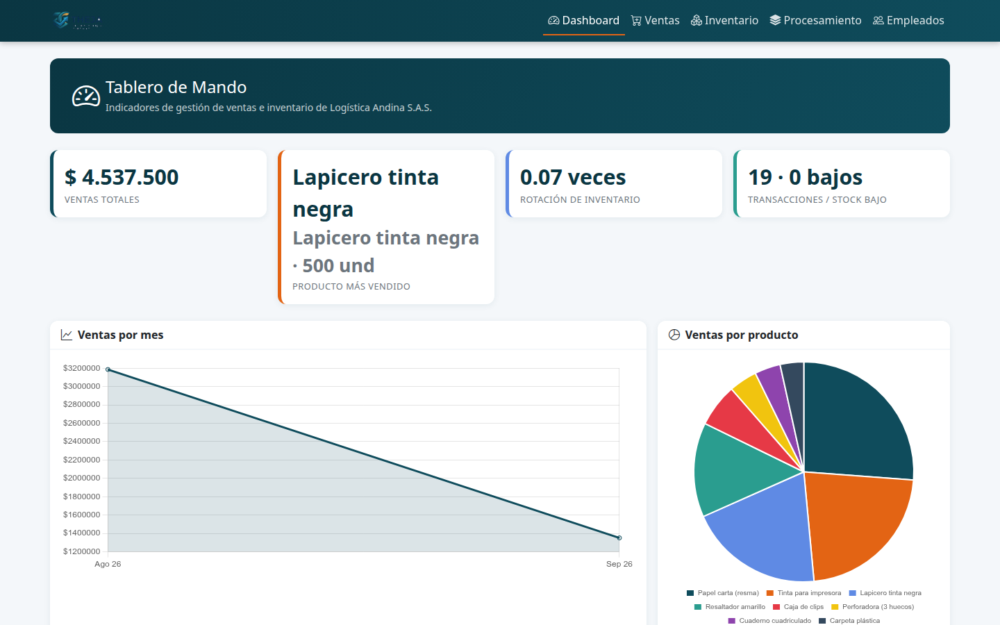
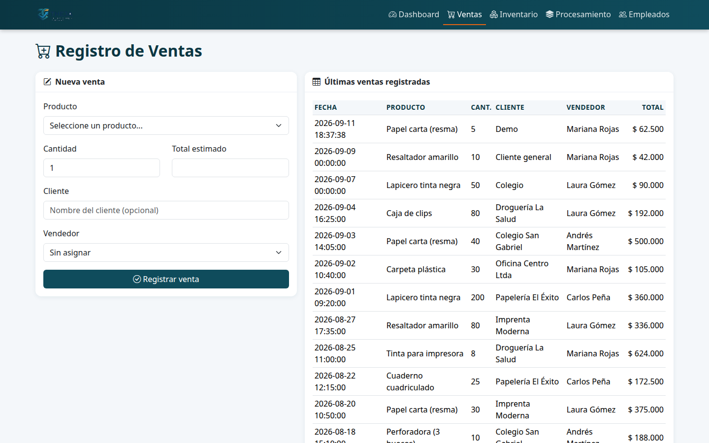
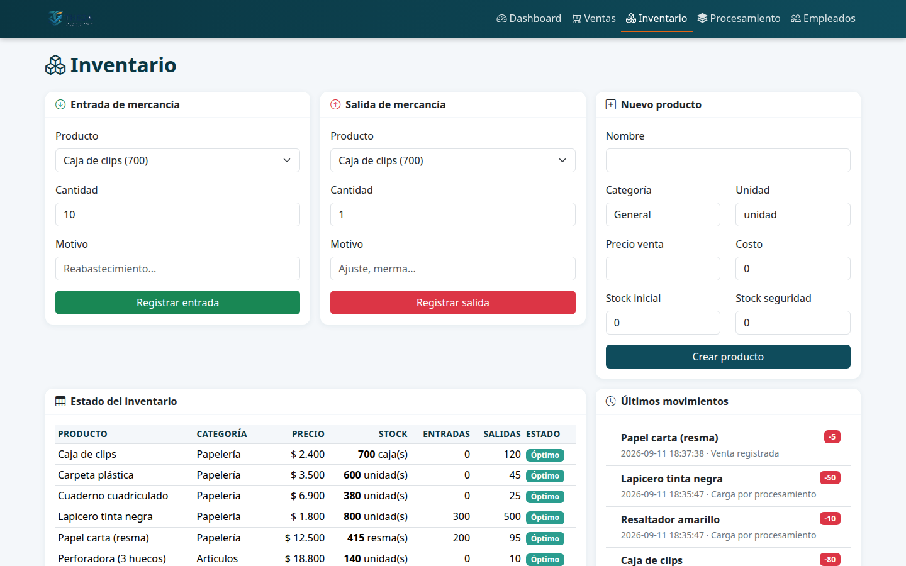
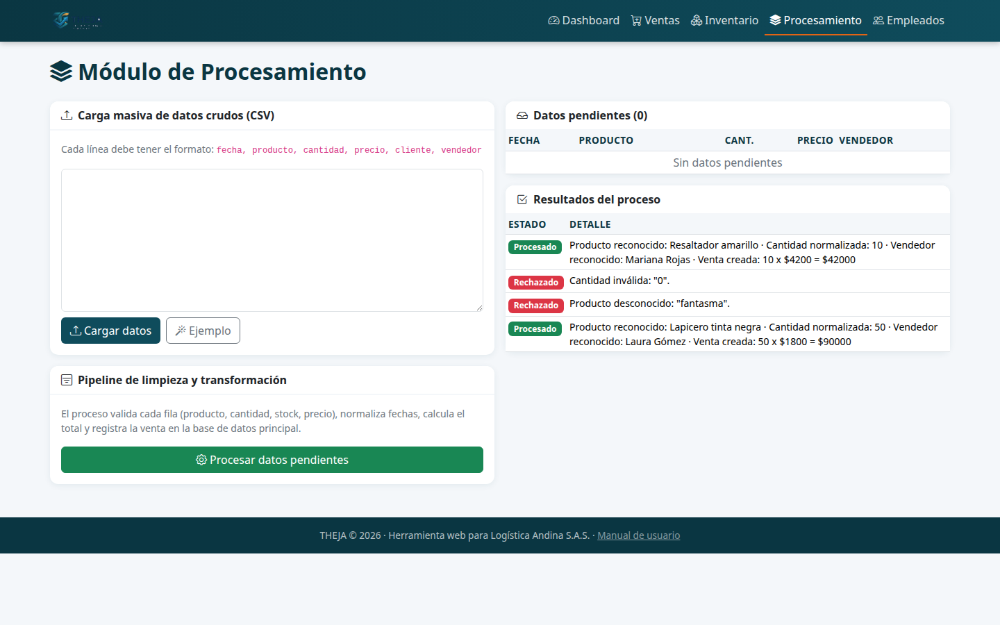
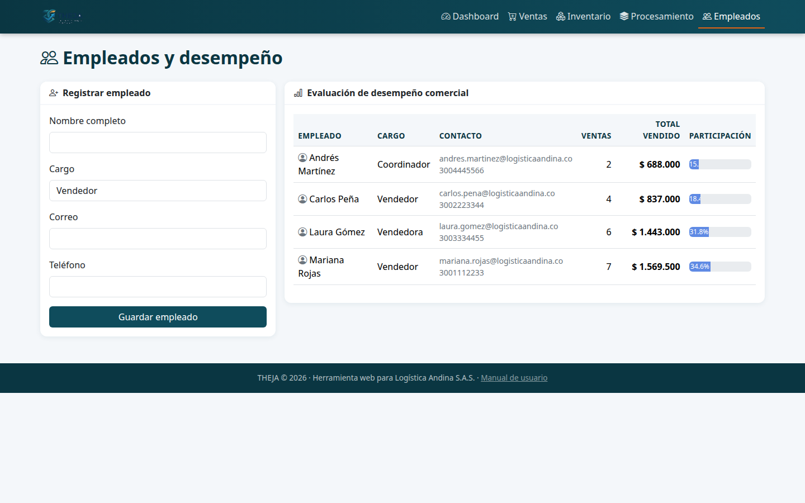
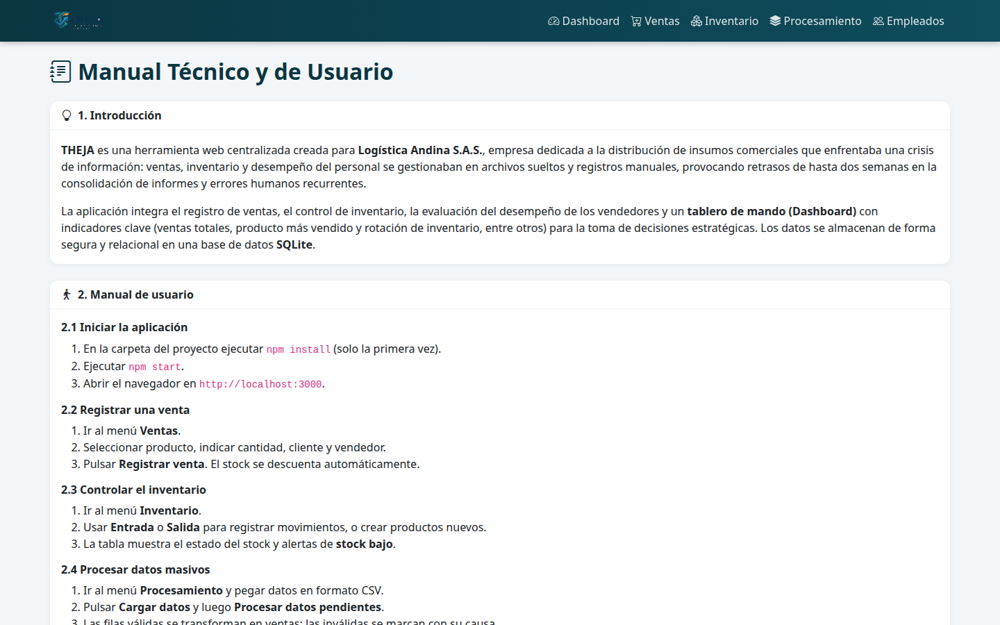

# THEJA
## Manual Técnico y de Usuario

**Proyecto ACA · Corte 3 · Opción B (Entorno Web)**
**Logística Andina S.A.S.**

---

## 1. Introducción

Logística Andina S.A.S. es una empresa colombiana de tamaño medio dedicada a la distribución de insumos
comerciales. Su gerencia enfrentaba una **crisis de información**: los registros de ventas, el control de
inventarios y la evaluación del desempeño del personal se manejaban de forma aislada en archivos de texto y
registros manuales. Esto provocaba:

- Retrasos de hasta **dos semanas** en la consolidación de informes mensuales.
- Pérdida de oportunidades de mercado por la incapacidad de analizar las ventas en tiempo real.
- Errores humanos recurrentes en la gestión de datos.

### 1.1. La solución

**THEJA** es una herramienta tecnológica centralizada que permite el paso hacia una *empresa inteligente*.
Sobre los conceptos teóricos de la asignatura (bases de datos relacionales, normalización, automatización de
procesos e indicadores de gestión), la aplicación:

1. **Centraliza los datos** en una base de datos relacional **SQLite** con integridad garantizada por claves
   foráneas, restricciones `CHECK` y transacciones.
2. **Automatiza el ingreso de datos** mediante formularios que nunca modifican la base de datos directamente:
   la interfaz solo consume los servicios API, garantizando arquitectura de 3 capas (vista, controlador, datos) y
   seguridad en el manejo de la información (validación de stock, cálculo de totales en el servidor).
3. **Automatiza la limpieza y transformación** de datos masivos (módulo de procesamiento).
4. **Visualiza indicadores clave** en un tablero de mando interactivo: ventas totales, producto más vendido,
   rotación de inventario, entre otros.

### 1.2. Alcance funcional

| Módulo | Funcionalidad |
|---|---|
| Ingreso de datos | Formularios de ventas, productos, movimientos de stock y empleados |
| Procesamiento | Carga masiva CSV, validación, normalización y transformación a ventas |
| Tablero de mando | KPIs y gráficos dinámicos (ventas por mes, por producto, desempeño de vendedores) |

---

## 2. Manual de usuario

### 2.1. Iniciar la aplicación

1. Abra una terminal en la carpeta del proyecto.
2. Ejecute `npm install` (solo la primera vez).
3. Ejecute `npm start`.
4. Abra el navegador en **http://localhost:3000**.

> La base de datos se crea **vacía** en la primera ejecución: productos, empleados y ventas se ingresan
> manualmente. Si se desea, `database/seed.sql` contiene datos de ejemplo **opcionales** (no se aplican solos).
> Para re-crear la base desde cero: `npm run init -- --reset`.

### 2.2. Tablero de mando (Dashboard)

La pantalla principal presenta los indicadores de gestión:



- **Ventas totales**, **producto más vendido**, **rotación de inventario** y **transacciones / alertas de stock bajo**.
- Gráfico de **ventas por mes**, gráfico de **ventas por producto** y **desempeño de vendedores**.
- Tabla de **ventas recientes**.

### 2.3. Registrar una venta



1. Ingrese al menú **Ventas**.
2. Seleccione el **producto**; se muestra su precio y el stock disponible.
3. Indique la **cantidad** (número entero). El **total estimado** se calcula automáticamente.
4. Opcionalmente escriba el **cliente** y seleccione el **vendedor**.
5. Pulse **Registrar venta**.

El sistema valida en el servidor que el stock sea suficiente, descuenta el inventario y registra el
movimiento de salida automáticamente. No es posible modificar la base de datos directamente.

### 2.4. Controlar el inventario



1. Ingrese al menú **Inventario**.
2. **Entrada de mercancía**: seleccione el producto, cantidad y motivo (reabastecimiento). El stock aumenta.
3. **Salida de mercancía**: seleccione el producto, cantidad y motivo (ajuste, merma). El stock disminuye y se
   valida que no se supere el disponible.
4. **Nuevo producto**: cree productos con nombre, categoría, unidad, precio de venta, costo, stock inicial y
   stock de seguridad.
5. La tabla muestra el estado del stock con alertas **Stock bajo** (stock ≤ stock de seguridad) u **Óptimo**, y
   el historial de movimientos.

### 2.5. Módulo de procesamiento (limpieza y transformación)



1. Ingrese al menú **Procesamiento**.
2. Pegue datos en formato CSV, una fila por línea:
   `fecha, producto, cantidad, precio, cliente, vendedor`
   (puede pulsar **Ejemplo** para cargar datos de prueba).
3. Pulse **Cargar datos**: las filas quedan como *datos pendientes*.
4. Pulse **Procesar datos pendientes**: el sistema valida y normaliza cada fila y, si es válida,
   la registra como venta (descontando stock). Las filas inválidas se marcan *Rechazada* con el motivo.

Ejemplo de entradas aceptadas:

| Entrada cruda | Resultado |
|---|---|
| `09/09/2026, lapicero tinta negra, 50, 1,800, Colegio, Laura Gómez` | Venta creada (precio y fecha normalizados) |
| `09/09/2026, producto fantasma, 5, 999, , Pepe` | Rechazada: producto desconocido |
| `09/09/2026, Cuaderno cuadriculado, 0, 6900, ,` | Rechazada: cantidad inválida |

### 2.6. Empleados y desempeño



1. Ingrese al menú **Empleados**.
2. Registre personal nuevo (nombre, cargo, correo, teléfono).
3. La tabla presenta el desempeño comercial (número de ventas, total vendido y participación) para la
   evaluación del personal que menciona el caso de estudio.

### 2.7. Manual dentro de la aplicación



La pestaña **Manual** del menú resume el manual técnico y de usuario de forma accesible desde la misma web.

---

## 3. Especificaciones técnicas

### 3.1. Arquitectura

```
Navegador (HTML5 + Bootstrap 5 + Chart.js)
        │  HTTP / JSON
        ▼
Express (API REST)
  ├─ src/api.js       → endpoints de productos, ventas, movimientos, empleados y datos crudos
  ├─ src/pipeline.js  → limpieza y transformación de datos masivos
  └─ src/db.js        → conexión SQLite, esquema y datos semilla
        ▼
SQLite (database/theja.db)
```

- **Backend:** Node.js ≥ 22.5, Express 4.
- **Base de datos:** SQLite mediante el módulo nativo `node:sqlite` (sin dependencias de compilación).
- **Frontend:** HTML5 + CSS + JavaScript, Bootstrap 5 y Chart.js (CDN).

### 3.2. Modelo de datos

| Tabla | Descripción |
|---|---|
| `productos` | Catálogo con precio de venta, costo, stock actual y stock de seguridad |
| `ventas` | Registro de ventas; el total se calcula en el servidor |
| `movimientos_inventario` | Entradas y salidas de mercancía, ligadas a ventas o manuales |
| `empleados` | Personal de la empresa |
| `datos_crudos` | Datos en bruto del módulo de procesamiento (estados: pendiente/procesado/error) |

Medidas de integridad y seguridad:

- `PRAGMA foreign_keys = ON` (claves foráneas activas).
- Restricciones `CHECK (cantidad > 0)` y `CHECK (tipo IN ('entrada','salida'))`.
- **Transacciones SQL** (`BEGIN/COMMIT/ROLLBACK`) para ventas y movimientos: la inserción de la venta y el
  descuento de stock ocurren como una sola operación atómica.
- **Validación en el servidor**: el precio total se calcula con el precio del catálogo (nunca del cliente);
  se valida stock disponible, existencia del producto y del vendedor, y que las cantidades sean enteras.
- **Validación de entradas**: al cargar JSON inválido se responde HTTP 400, y los errores de validación
  devuelven mensajes claros (nunca errores internos 500).

### 3.3. Fórmulas y algoritmos utilizados

- **Total de la venta:** `total = cantidad × precio_unitario`, con precio unitario tomado del catálogo.
- **Rotación de inventario:**
  `rotación = costo de mercancía vendida / valor del inventario actual`
  `= Σ(cantidad vendida × costo) / Σ(stock actual × costo)`.
- **Producto más vendido:** `SUM(cantidad)` agrupado por producto, orden descendente, límite 1.
- **Normalización de fechas:** `dd/mm/aaaa` o `dd-mm-aaaa` → `aaaa-mm-dd HH:MM:SS`.
- **Normalización de números:** soporta formato colombiano (separadores de miles con punto o coma, decimales con coma, símbolo de moneda); se normaliza a número al cargar (ej.: `1.800`→1800, `12.500,50`→12500.5).
- **Alertas de stock:** `stock_actual ≤ stock_seguridad` ⇒ alerta "Stock bajo".

### 3.4. API REST

| Método | Endpoint | Descripción |
|---|---|---|
| GET | `/api/resumen` | Indicadores para el tablero de mando |
| GET | `/api/productos` | Catálogo de productos |
| POST | `/api/productos` | Crear producto |
| GET | `/api/ventas` | Listar ventas |
| POST | `/api/ventas` | Registrar venta (descuenta stock en transacción) |
| GET | `/api/inventario` | Estado del inventario con entradas/salidas |
| GET | `/api/movimientos` | Historial de movimientos |
| POST | `/api/movimientos` | Entrada o salida de mercancía |
| GET | `/api/empleados` | Empleados y desempeño |
| POST | `/api/empleados` | Registrar empleado |
| GET | `/api/crudos` | Datos pendientes y resultados del proceso |
| POST | `/api/crudos/cargar` | Cargar filas CSV como datos pendientes |
| POST | `/api/procesar` | Ejecutar limpieza y transformación |

---

## 4. Prompt Engineering (anexo: uso de IA)

Durante el desarrollo se usaron herramientas de Inteligencia Artificial generativa para acelerar la
construcción, corregir errores y mejorar la calidad del entregable. La estructura de los prompts siguió el
método **CTF** (Contexto, Tarea, Formato).

1. **Backend (API REST):**
   *"Soy estudiante de Análisis y Desarrollo de Software. Crea una API REST en Node.js con Express y SQLite
   (`node:sqlite`) para Logística Andina S.A.S., una distribuidora de insumos. Debe permitir registrar ventas,
   controlar inventario con entradas/salidas y usar transacciones para que el descuento de stock sea atómico."*
2. **Tablero de mando:**
   *"Diseña un tablero de mando con Bootstrap y Chart.js que muestre ventas totales, producto más vendido,
   rotación de inventario, ventas por mes y desempeño de vendedores."*
3. **Corrección de errores (depuración):**
   *"Al enviar cantidades decimales la venta se registra mal. ¿Cómo valido que la cantidad sea un número entero
   positivo y devuelva un error 400 en lugar de aceptar el dato corrompido?"*
4. **Logo:**
   *"Genera un logotipo para 'THEJA' usando azul petróleo (#0F4C5C) y naranja (#E36414), sin fondo."*
5. **Manual:**
   *"Redacta el manual técnico y de usuario de una aplicación web de gestión de ventas e inventario con
   introducción, instrucciones paso a paso con capturas y especificaciones técnicas."*

> La IA fue una herramienta de apoyo: cada resultado se revisó, adaptó y probó para garantizar que cumpliera
> los requerimientos del caso de estudio. Todo el código, las validaciones y las pruebas fueron verificadas
> manualmente.